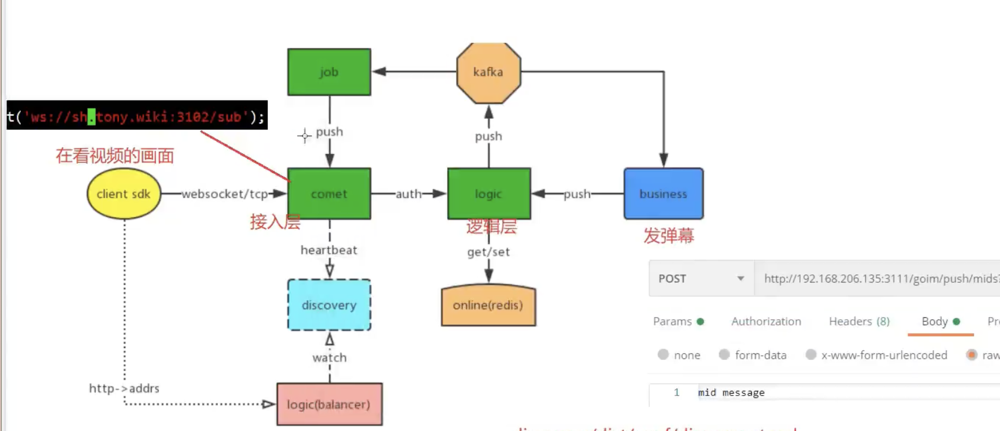
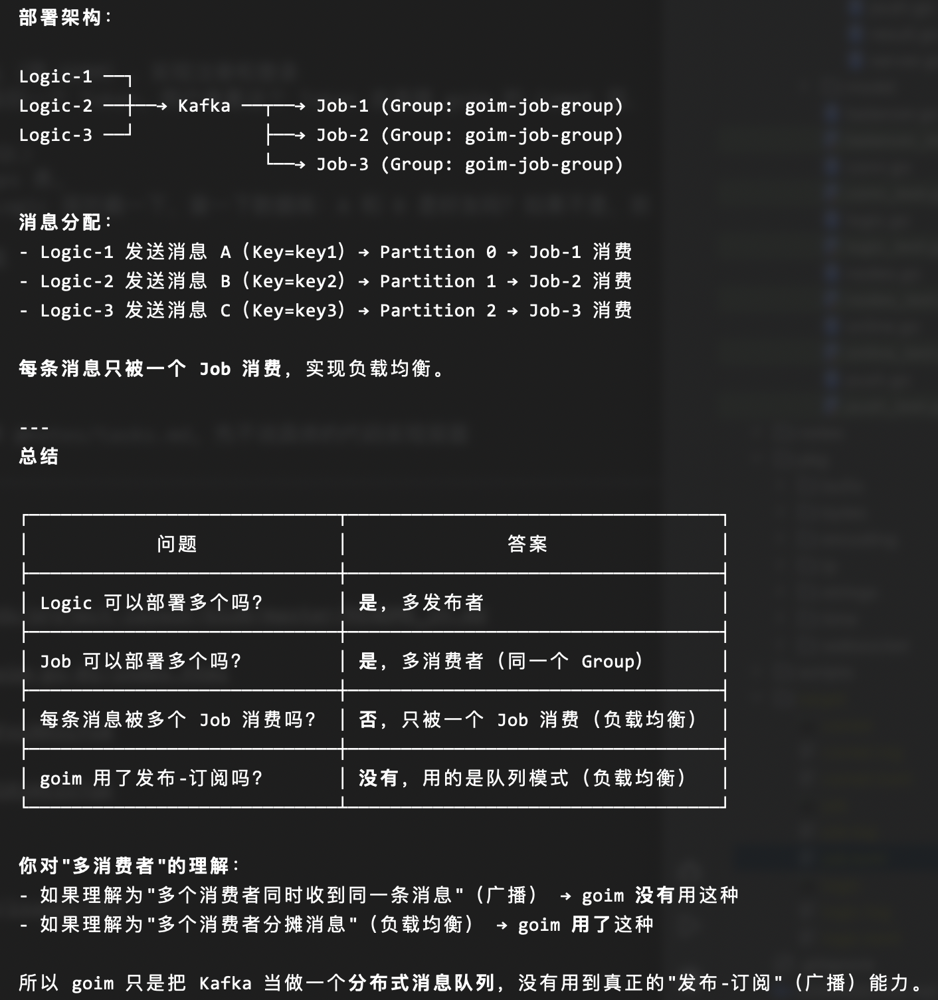

tasks

我 clone 了 goim (https://github.com/Terry-Mao/goim/tree/master), 想要学习, 理解, 对其二次开发, 作为个人面试项目  

我现在掌握了go基础语法；掌握一点go标准库。
会一些 gin 框架，GORM，mysql 和 redis，了解少量 mq 知识

想要一个月内完成这个项目

我决定在二次开发中, 先作出下面的化简:
    - 砍掉 Zookeeper/Discovery, 将 goim 内部的服务发现改为简单的配置文件硬编码 IP
        - 只专注于 web 客户端, 移除部分未使用的 protocol

作出的改动:
    - 参考 https://github.com/Terry-Mao/goim/issues/262, 将 kafka 替换成其他的 mq 组件, 如 nats. 为此 使用 interface 对 kafka 进行抽象和解耦

增加的业务 (用 gin 和 GORM 补全业务):
    - 用户系统
      - 写个 Gin 接口，把用户信息存入 MySQL（用 GORM）, 实现注册和登录
      - 鉴权 (JWT)： 用户登录成功后，Gin 返回一个 Token。用户拿着这个 Token 去连接 goim 的 Comet 层，Logic 层去校验这个 Token
        - 好友与群组关系 (用 GORM 操作 MySQL)
      - 数据库设计： 设计 friends 表、groups 表。
      - 逻辑校验： 当 A 给 B 发消息时，在 Logic 层拦截一下，查一下数据库：A 和 B 是好友吗？如果不是，拒绝发信。这就是“业务逻辑”。
        - 消息持久化: 支持历史记录和离线消息

最后实现 docker 化部署

二次开发不希望涉及任何的前端部分

我的想法如何, 请参考我的想法, 写一份todo清单 @notes/tasks.md, 先不说具体的代码实现层面

---

## links

> https://github.com/golang-standards/project-layout/blob/master/README_zh.md
>
> https://tsingson.github.io/tech/goim-go-01/index.html
>
> https://www.youtube.com/watch?v=bFniRH3ifx8
>
> https://www.bilibili.com/video/BV1R34y157q6
>
> 
>
> https://github.com/Terry-Mao/goim/issues/262

## run

```sh
docker pull zookeeper:latest

docker pull wurstmeister/kafka:latest

docker pull nats:latest

docker run -d --name zookeeper -p 2181:2181 zookeeper

docker run -d --name kafka -p 9092:9092 \
    --link zookeeper \
    --env KAFKA_ZOOKEEPER_CONNECT=zookeeper:2181 \
    --env KAFKA_ADVERTISED_LISTENERS=PLAINTEXT://localhost:9092 \
    --env KAFKA_LISTENERS=PLAINTEXT://0.0.0.0:9092 \
    wurstmeister/kafka

docker run -d --name nats \
    -p 4222:4222 \
    -p 6222:6222 \
    -p 8222:8222 \
    nats:latest --jetstream
    
##

docker run -d --name mysql \
    -p 3306:3306 \
    -e MYSQL_ROOT_PASSWORD=password \
    -e MYSQL_DATABASE=goim \
    mysql:latest

docker exec -it mysql mysql -uroot -ppassword -e "SHOW DATABASES;"
```

```sh
# check
lsof -i :2181  # zookeeper
lsof -i :9092  # kafka
lsof -i :6379  # redis
```

```sh
# cd discovery/cmd/discovery
./discovery -conf discovery.toml
# cd goim/
export REGION=sh
export ZONE=sh001
export DEPLOY_ENV=dev
make build
```

```sh
lxl@k17814 ~ $ps                                                          [0]
  PID TTY           TIME CMD
49283 ttys007    0:00.03 target/logic -conf=target/logic.toml -region=sh -zone=sh001 -deploy.env
49285 ttys007    0:00.03 target/comet -conf=target/comet.toml -region=sh -zone=sh001 -deploy.env
49287 ttys007    0:00.03 target/job -conf=target/job.toml -region=sh -zone=sh001 -deploy.env=dev
49041 ttys008    0:00.33 ./discovery -conf discovery.toml
```

## structure

```
goim/
├── cmd/           # 服务启动入口
├── config/        # 服务配置文件
├── deploy/        # 部署配置（Docker、K8s）
├── docs/          # 项目文档
├── internal/      # 私有代码（不对外暴露）
├── pkg/           # 公共代码（可被外部引用）
├── sql/           # 数据库脚本
└── test/          # 测试代码
```

---

websocket api



- 登录 `ws://127.0.0.1:3102/sub`

---





换用反序列化更快的, 比 protobuf 反序列化快2个数量级的协议 (flatbuffer?)
一个地方序列化, 其他地方不断拆包


 dao.go 通过 switch c.MQType 做工厂选择，调用方（produce.go）完全不感知具体实现


dao <- gateway <- http
